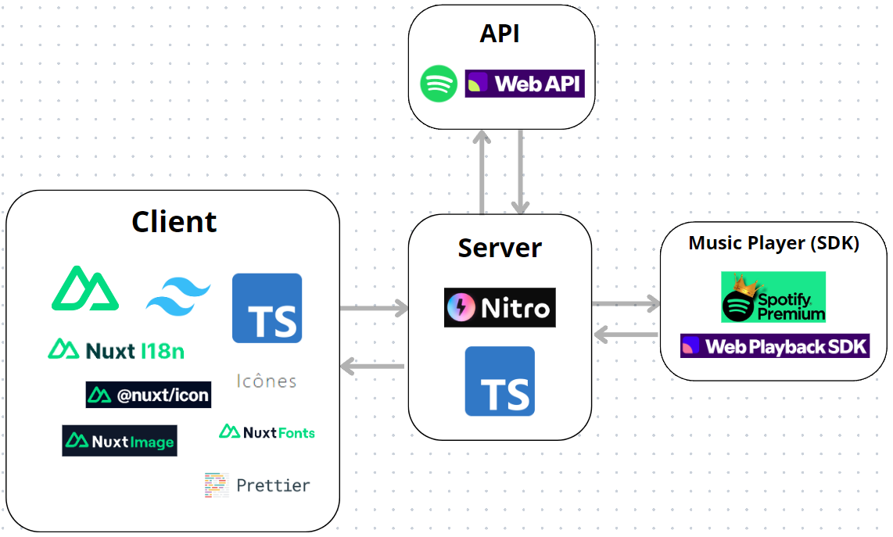

# Ongaku - web music player

## Introduction

Ongaku - is a web music player built on top of _Spotify Web API_ and _Spotify Player SDK_.

## Ongaku > Spotify? (no)

1. Color theme.
2. Dynamic localization.
3. Advanced filtering.
4. Preview of next track?
5. Mobile design for web browsers (Spotify is sorry).

## Technological aspect

<table>
	<tbody>
		<tr>
			<th>Field</th>
			<th>Application</th>
		</tr>
		<tr>
			<td>Framework</td>
			<td>Nuxt.js (v3)</td>
		</tr>
		<tr>
			<td>Language</td>
			<td>JavaScript (TypeScript)</td>
		</tr>
		<tr>
			<td>Styling</td>
			<td>Tailwind CSS</td>
		</tr>
		<tr>
			<td>State Management</td>
			<td>Pinia</td>
		</tr>
		<tr>
			<td>Internationalization</td>
			<td>Nuxt i18n</td>
		</tr>
		<tr>
			<td>Icons</td>
			<td>Nuxt Icon</td>
		</tr>
		<tr>
			<td>Images</td>
			<td>Nuxt Image</td>
		</tr>
		<tr>
			<td>Fonts</td>
			<td>Nuxt Fonts</td>
		</tr>
		<tr>
			<td>Icons</td>
			<td>Nuxt Icon</td>
		</tr>
		<tr>
			<td>API Handling</td>
			<td>OFetch</td>
		</tr>
		<tr>
			<td>Code Quality</td>
			<td>Prettify</td>
		</tr>
	</tbody>
</table>

## Architecture

## Manual

1. Pull the project.
2. Run `npm install` to install packages.
3. Run `npm run dev` to launch the project in the development mode.
4. OR, run `npm run build` to build the project in the production mode.
